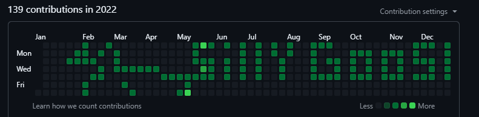

# Commit Art

Draw in your commit history.

## How it works

1. open grid.html and use the checkboxes to draw. Once you're satisfied hit "Generate Pattern". This creates a .txt file that you can use to make the drawing.
2. run the script using `python generate_commits.py`

- the prompt will ask for a date and the name of the file assuming the .txt file is in the same location as the repo.

3. use normal git commits to add and push to main.

4. Log into your github and see the art!

## Dependencies:

1. python

## License

This project is licensed under the MIT License - see the [LICENSE](LICENSE) file for details.
